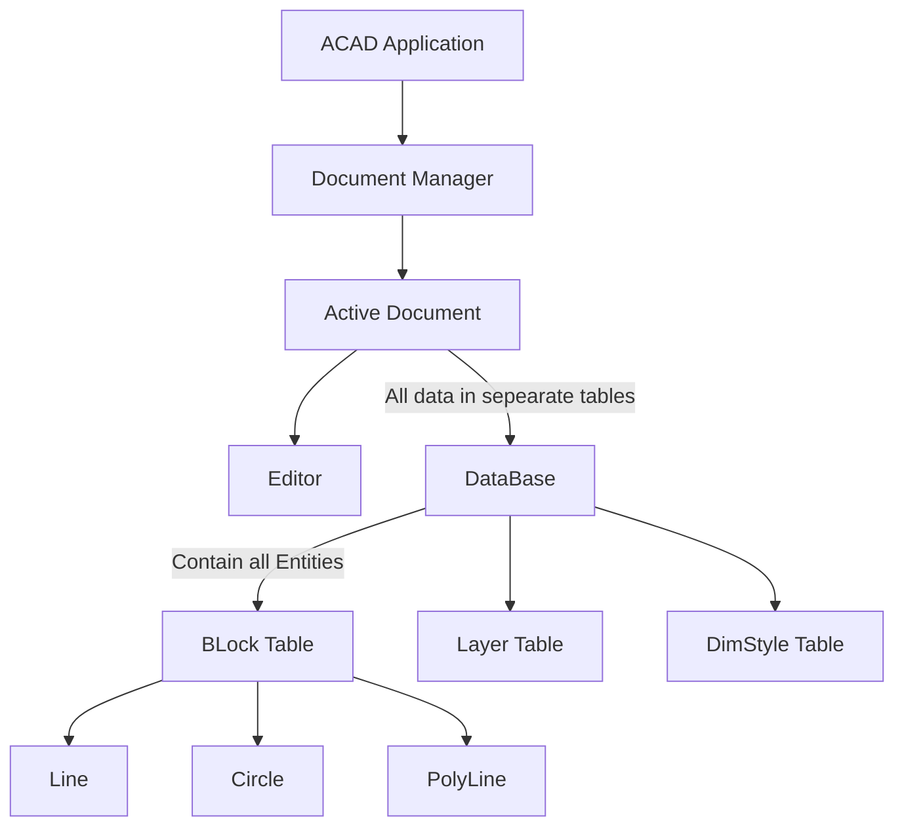
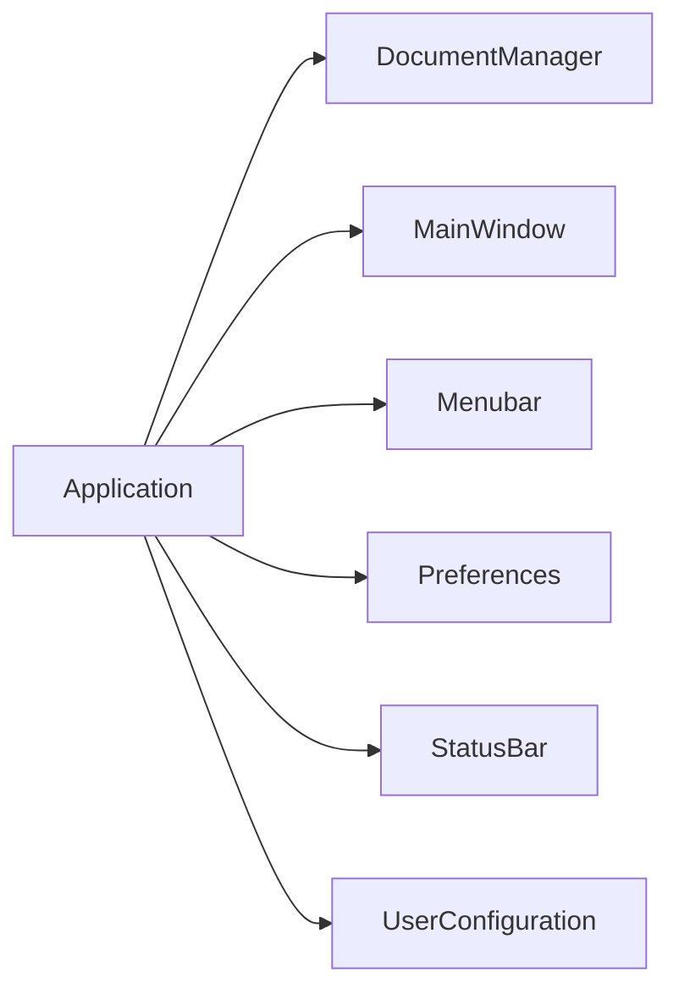
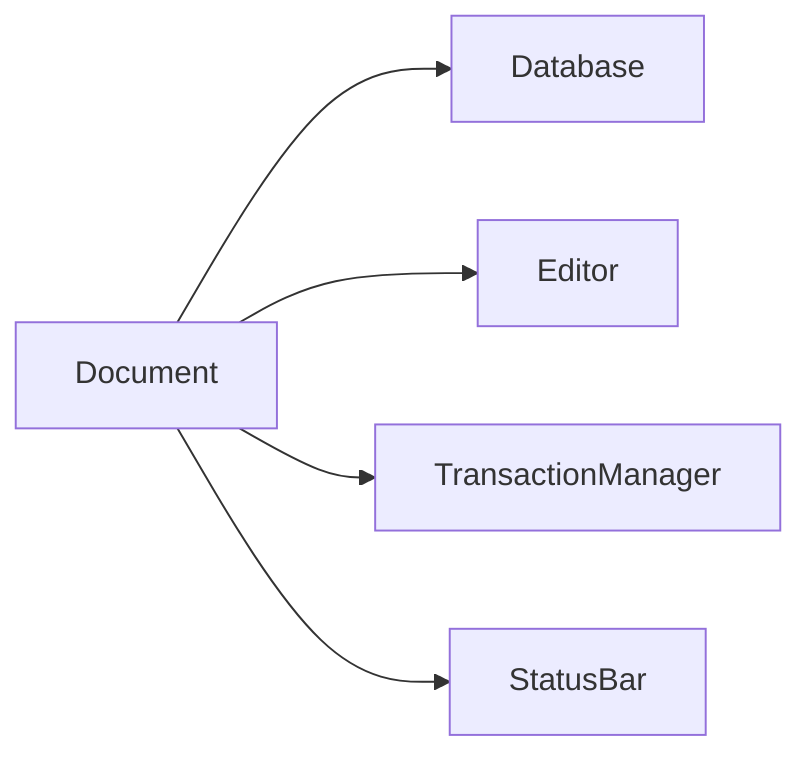
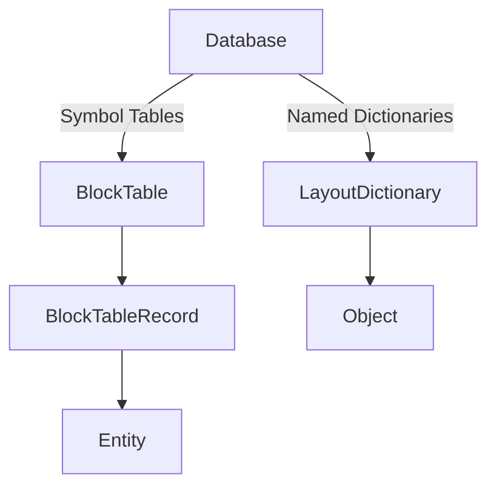

### AutoCAD Object Model As per my personal Understanding

- Reference : [Official Docs](http://docs.autodesk.com/ACD/2010/ENU/AutoCAD%20.NET%20Developer%27s%20Guide/index.html?url=WS73099cc142f48755-5c83e7b1120018de8c0-233d.htm,topicNumber=d0e1788)

### Application Object
- From the Application object, you can access the main window as well as any open drawing.
- For example, the Application object has a DocumentManager property that returns the DocumentCollection object. This object provides access to the the drawings that are currently open in AutoCAD and allows you to create, save and open drawing files. Other properties of the Application object provide access to the application-specific data such as InfoCenter, the main window, and the status bar.The MainWindow property allows access to the application name, size, location, and visibility.

### Document Object
The Document object, which is actually an AutoCAD drawing, is part of the DocumentCollection object and provides access to the Database object which is associated with the Document object. The Database object contains all of the graphical and most of the nongraphical AutoCAD objects.

### Database Object
- Contains all graphical and nongraphical objects. Some of the objects contained in the database are entities, symbol tables, and named dictionaries. 
- Entities in the database represent graphical objects within a drawing. Lines, circles, arcs, text, hatch, and polylines are examples of entities. A user can see an entity on the screen and can manipulate it.

- Symbol table and dictionary objects provide access to nongraphical objects (blocks, layers, linetypes, layouts, and so forth).
- Each drawing contains a set of nine fixed symbol tables, whereas the number of dictionaries in a drawing can vary based on the features and types of applications used in AutoCAD. New symbol tables cannot be added to a database.
- Examples of symbol tables are the layer table (LayerTable), which contains layer table records, and the block table (BlockTable), which contains block table records.
- All graphical entities (lines, circles, arcs, and so forth) are owned by a block table record. 
- A dictionary is a container object which can contain any AutoCAD object or an XRecord. Dictionaries are stored either in the database under the named object dictionary or as an extension dictionary of a table record or graphical entity. The named object dictionary is the master table for all of the dictionaries associated with a database. Unlike symbol tables, new dictionaries can be created and added to the named object dictionary.
> Dictionary objects cannot contain drawing entities.

### Graphical and non-Graphical Objects
- Graphical objects, also known as entities, are the visible objects (lines, circles, raster images, and so forth) that make up a drawing. Adding graphical objects to a drawing is done by referencing the correct block table record, and then using the AppendEntity method with the new object to append it to the drawing.
- To modify or query objects, obtain a reference to the object from the appropriate block table record, and then use the methods or properties of the object itself. Each graphical object has methods that perform most of the same functionality as the AutoCAD editing commands such as Copy, Erase, Move, Mirror, and so forth.
- Nongraphical objects are the invisible (informational) objects that are part of a drawing, such as Layers, Linetypes, Dimension styles, Table styles, and so forth.
- To create a new symbol table records, use the Add method on the owner table or use the SetAt method to add a dictionary to the named object dictionary. To modify or query these objects, use the methods or properties of the object itself.
