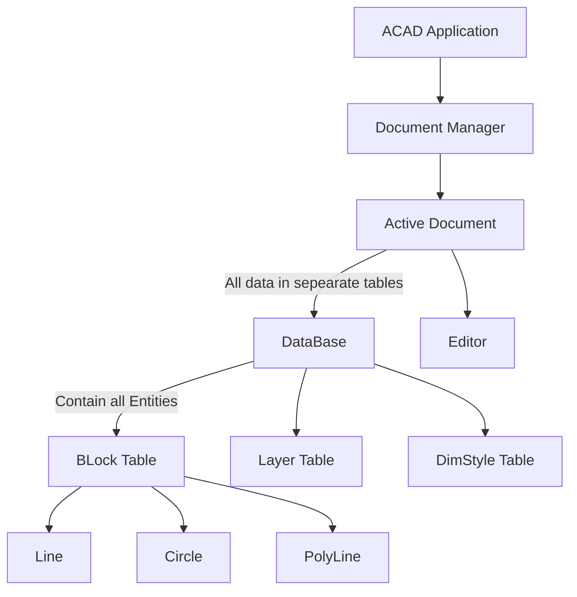

### AutoCAD Object Model As per my personal Understanding

### Application Object
- From the Application object, you can access the main window as well as any open drawing.
- For example, the Application object has a DocumentManager property that returns the DocumentCollection object. This object provides access to the the drawings that are currently open in AutoCAD and allows you to create, save and open drawing files. Other properties of the Application object provide access to the application-specific data such as InfoCenter, the main window, and the status bar.The MainWindow property allows access to the application name, size, location, and visibility.
- http://docs.autodesk.com/ACD/2010/ENU/AutoCAD%20.NET%20Developer%27s%20Guide/index.html

### Document Object
The Document object, which is actually an AutoCAD drawing, is part of the DocumentCollection object and provides access to the Database object which is associated with the Document object. The Database object contains all of the graphical and most of the nongraphical AutoCAD objects.
```mermaid
graph LR
Document-->Database
Document-->Editor
Document-->Transaction Manager
Document-->StatusBar
```
