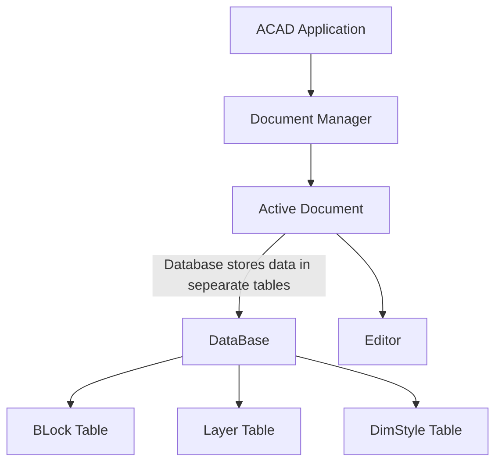

### AutoCAD Object Model As per my personal Understanding

```mermaid
graph TD
A[ACAD Application]-->B[Document Manager]
B-->C[Active Document]
C-->|Database stores data in sepearate tables|D[DataBase]
C-->E[Editor]
D-->F[BLock Table]
D-->G[Layer Table]
D-->H[DimStyle Table]
```
