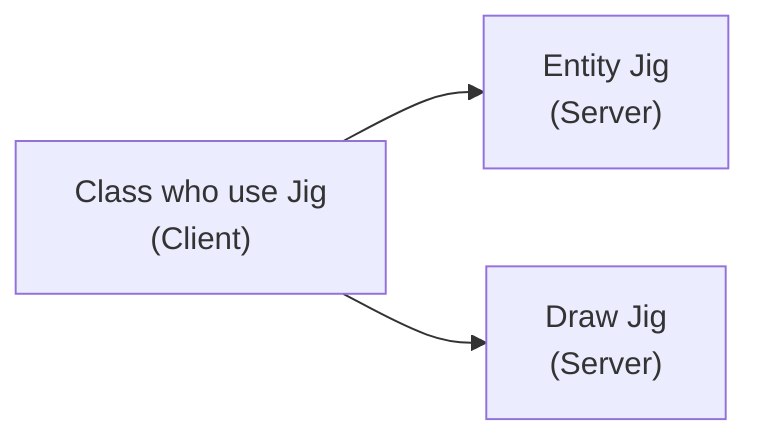

### References
- https://benkoshy.github.io/2018/01/24/what-is-a-jig.html
- https://cupocadnet.blogspot.com/2009/03/jigging-multiple-entities-with-drawjig.html
- https://spiderinnet1.typepad.com/blog/2012/05/autocad-net-use-drawjig-to-drag-and-create-rectangles.html

### What is it?
- All Jig code contain two class
  - Server Class : Class which contain code to take jig input from user like distance, angle, point and update entity using this inputs
  - Client Class : one who use server class to get job done

- There are 2 kinds of jigs : EntityJig and DrawJig
  - Both are inbuit AutoCAD class
  - you can not use this class Directly since both are abstract class
  - you have to build your own jig class using this as base 
  - EntityJig only allows us to jig one entity at the time
  - DrawJig Support multiple entity
  

- [Demo of Jig](https://nodesauto-my.sharepoint.com/:v:/g/personal/vivek_nodesautomations_com/EceO2Tt4uiJHtQGe16CBlJYB23LiZWwTvU6Uo25j6QnCnw?e=cIYehJ)