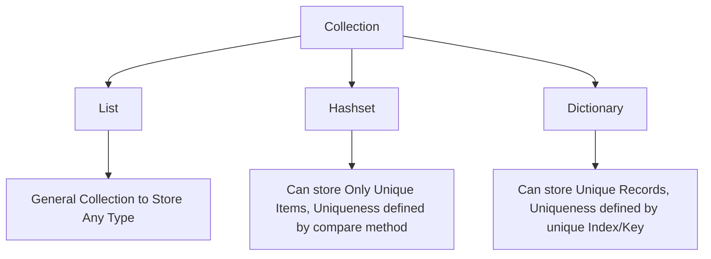

```mermaid
graph TD;
Collection-->List
Collection-->Hashset
Collection-->Dictionary
List-->ListDetail[General Collection to Store Any Type]
Hashset-->HashsetDetail[Can store Only Unique Items, Uniqueness defined by compare method]
Dictionary-->DictionaryDetail[Can store Unique Records, Uniqueness defined by unique Index/Key]
```
