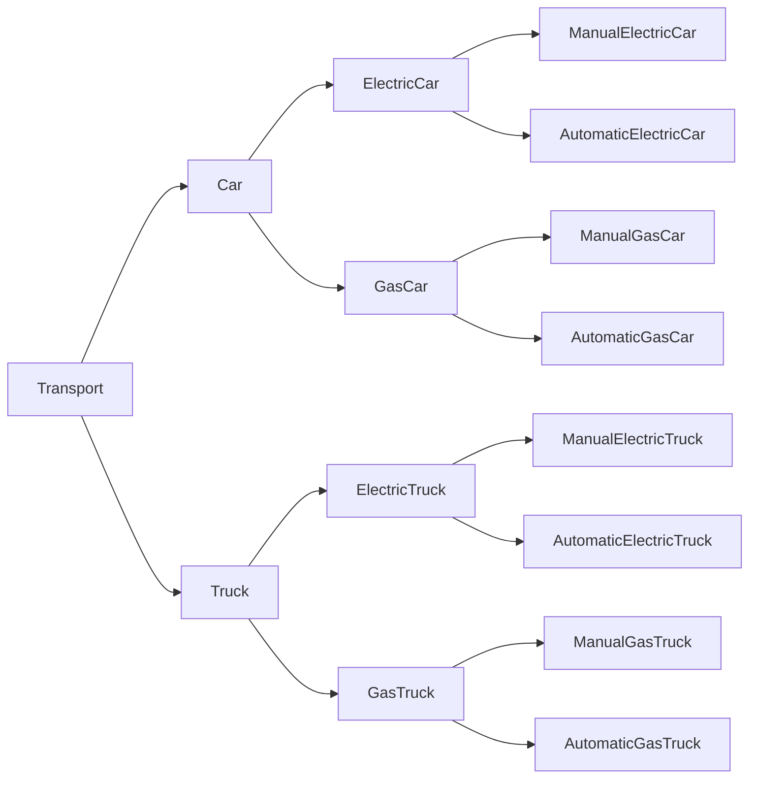
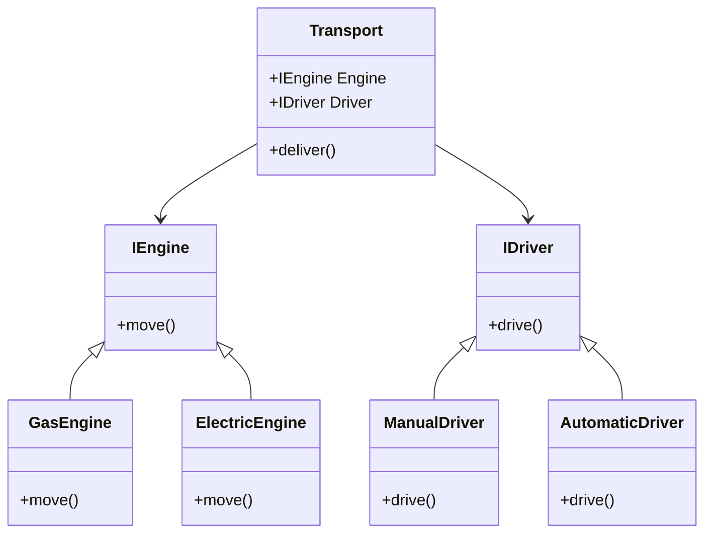

# Composition over Inheritance

## Overview
- Inheritance is most obvious way to reuse code between classes. but it comes with cavets that only become apparent after your program has already tons of classes and changing anything is pretty hard. Few of those problems are listed below.

### Subclass can't reduce interface of superclass
- You have to implement all abstract methods of the parent class even if you won't be using them.

### When overridign methods you need to make sure that the new behavior is compatible with base one.
- It's important because objects of the subclss may be passed to any code that expects objects of the superclass and don't want that code to break.

### Inheritance breaks encapsulation of the superclass
- when internal details of the parent class become available to the subclass, there might be opposite situation where programmer makes a superclass aware of soem details of subclass for the sake of making further extension easier.

### Subclasses are tightly coupled to their superclasses
- Any change in a superclass may break the functionality of subclasses.

### Trying to reuse code through inheritance can lead to creting parallel inheritance hierarchies
- Inheritance usually takes place in a single dimension. But whenevere there are two or more dimensions you have to create lot of class combinations bloating the class hierarchy to ridiculous levels.

## Composition

### Overview
- There's alternative to inheritance called composition.
- Whereas inheritance is a "is-a" relationship, composition is a "has-a" relationship.

### Example
- Imangine that you need to create catalog app for a car manufacturer.
- The company makes both cars and trucks, which can be either electric or gas-powered, manual or automatic.
- This heiarchy can be represented as follows:

- As you can see each additional parameter results in multiplication of the number of classes. There's lot of duplication of code between classes and subclasses because subclasses can't extend two classes at the same time.
- This is where composition comes in handy, allowing you to combine behaviors and functionalities without creating an explosion of subclasses.

- Here transport can have engine and driver as interfaces.
- This is also called strategy pattern.
