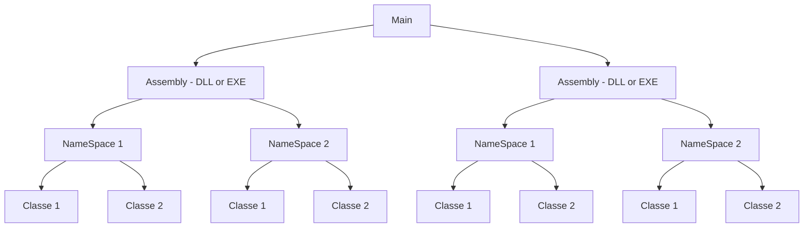

```mermaid
graph TD
A[Main]
A-->A1
A-->A2

A1[Assembly - DLL or EXE]
A1-->B1[NameSpace 1]
A1-->B2[NameSpace 2]
B1-->C1[Classe 1]
B1-->C2[Classe 2]
B2-->C3[Classe 1]
B2-->C4[Classe 2]	

A2[Assembly - DLL or EXE]
A2-->AB1[NameSpace 1]
A2-->AB2[NameSpace 2]
AB1-->AC1[Classe 1]
AB1-->AC2[Classe 2]
AB2-->AC3[Classe 1]
AB2-->AC4[Classe 2]
```
