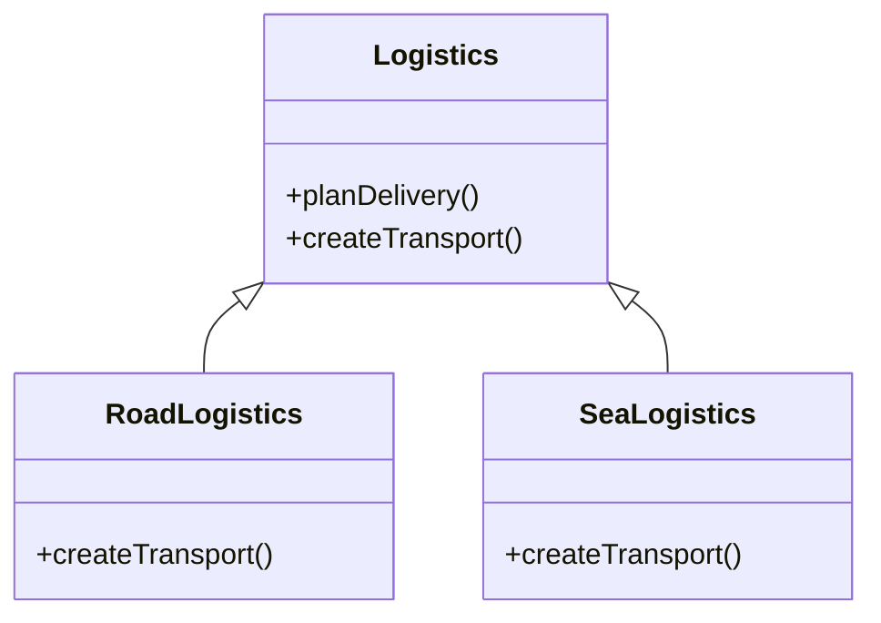

# Factory Pattern

## Overview
- Factory Pattern is a **creational design pattern** that provides an interface for creating objects in a superclass, but allows subclasses to alter the type of objects that will be created.

## Problem
- Imagine that you're creating logistics management application. The first version of your app can only handle transpotation by truck, so bulk of your code lives inside `Truck` class.
- After a while, your app becomes popular and each day re receive dozen request to incorporate sea transportation.
- Now adding a new class to the program isn't that simple if the rest of the code is already compled to existing classes.
- Now comming back to our problem adding ships into app would require making changes to the entire codebase. Also in future if you want to add another type of transportation, you'll probably need to make all of these changes again.
- As a result, you'll end up with pretty nasty code, riddle with conditionals that switch the app's behavior depending on the class of transportation objects.

## Solution
- The factory method pattern suggests that you **replace the direct object construction calls** with calls to a special factory method. 
- Objects are still created by calling new constructor, but from within a factory method. 
- Objects returned by a factory method are usually referred to as **products**.



## Example
- Suppose we're writing a report exporter.
```csharp
 public interface IExporter
 {
     void Export(string data);
 }

 public class PdfExporter :IExporter
 {
     public void Export(string data)
     {
         Console.WriteLine("Exporting data to PDF: " + data);
     }
 }
 public class CsvExporter : IExporter
 {
     public void Export(string data)
     {
         Console.WriteLine("Exporting data to CSV: " + data);
     }
 }
 public class ExcelExporter : IExporter
 {
     public void Export(string data)
     {
         Console.WriteLine("Exporting data to Excel: " + data);
     }
 }
```

- Then our main method look like this
```csharp
private static void Main()
{
    // This could be dynamically set based on user input or configuration
    string format = "pdf"; 
    IExporter exporter;

    if (format == "pdf")
    {
        exporter = new PdfExporter();
    }
    else if (format == "csv")
    {
        exporter = new CsvExporter();
    }
    else if (format == "excel")
    {
        exporter = new ExcelExporter();
    }
    else
    {
        throw new ArgumentException("Invalid export format");
    }
    exporter.Export("Sample Data");
}
```

- Using factory pattern, we can refactor the code to remove the conditional logic to factory class

```csharp
 public class ExporterFactory
 {
     public static IExporter GetExporter(string format)
     {
         return format.ToLower() switch
         {
             "pdf" => new PdfExporter(),
             "csv" => new CsvExporter(),
             "excel" => new ExcelExporter(),
             _ => throw new ArgumentException("Invalid export format")
         };
     }
 }
 ```

 - So now our main method can be simplified to:
```csharp
private static void Main()
{
    // This could be dynamically set based on user input or configuration
    string format = "pdf"; 
    IExporter exporter = ExporterFactory.GetExporter(format);
    exporter.Export("Sample Data");
}
```