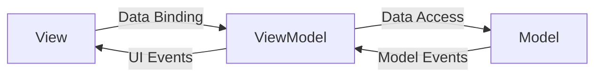

## Overview
- MVVM (Model-View-ViewModel) is a design pattern used in WPF applications to separate the user interface (View) from the business logic (Model).
- In MVVM Code behind is generally avoided and the ViewModel acts as a mediator between the View and the Model.
- No business logic is written in the View, and the ViewModel handles all the logic and data binding.

## Use Case
- More suitable for large applications where the separation of concerns is important.
- Helps in unit testing as the ViewModel can be tested independently of the View.
- If you don't have large project and want to keep things simple, you can use code-behind approach instead of MVVM.
- For small applications, MVVM can be overkill and may introduce unnecessary complexity.

## Sample Code