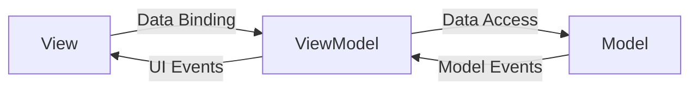

## Overview
- MVVM (Model-View-ViewModel) is a design pattern used in WPF applications to separate the user interface (View) from the business logic (Model).
- In MVVM Code behind is generally avoided and the ViewModel acts as a mediator between the View and the Model.
- No business logic is written in the View, and the ViewModel handles all the logic and data binding.



## Use Case
- More suitable for large applications where the separation of concerns is important.
- Helps in unit testing as the ViewModel can be tested independently of the View.
- If you don't have large project and want to keep things simple, you can use code-behind approach instead of MVVM.
- For small applications, MVVM can be overkill and may introduce unnecessary complexity.

## Sample Code

### Model
- Model code don't contain any logic, it is just a data structure that holds the data.
- Also no wpf specific code is written in model, it is just a simple class with properties.

```csharp
public class Client
{
    public string Name { get; set; }
    public double Rate { get; set; }
}
```

### View
- View is the user interface of the application, it contains XAML code that defines the layout and appearance of the UI elements.

```xml
<ListView ItemsSource="{Binding Clients}">
    <ListView.ItemTemplate>
        <DataTemplate>
            <StackPanel Orientation="Horizontal">
                <TextBlock Text="{Binding Name}"/>
                <TextBlock Text="{Binding Rate}" Margin="20,0,0,0"/>
            </StackPanel>
        </DataTemplate>
    </ListView.ItemTemplate>
</ListView>
```
```csharp
//Code behind of the view
public partial class MainWindow : Window
{
    public MainWindow()
    {
        InitializeComponent();
        DataContext = new MainViewModel();
    }
}
```

### ViewModel
- ViewModel is the heart of MVVM pattern, it contains all the logic and data binding.

```csharp
 public class MainViewModel 
 {
     public ObservableCollection<Client> Clients { get; }= new();

     public MainViewModel()
     {
         Clients.Add(new Client
         {
             Name = "ABC",
             Rate = 1500
         });

         Clients.Add(new Client
         {
             Name = "XYZ",
             Rate = 2000
         });
     }
 }
 ```


